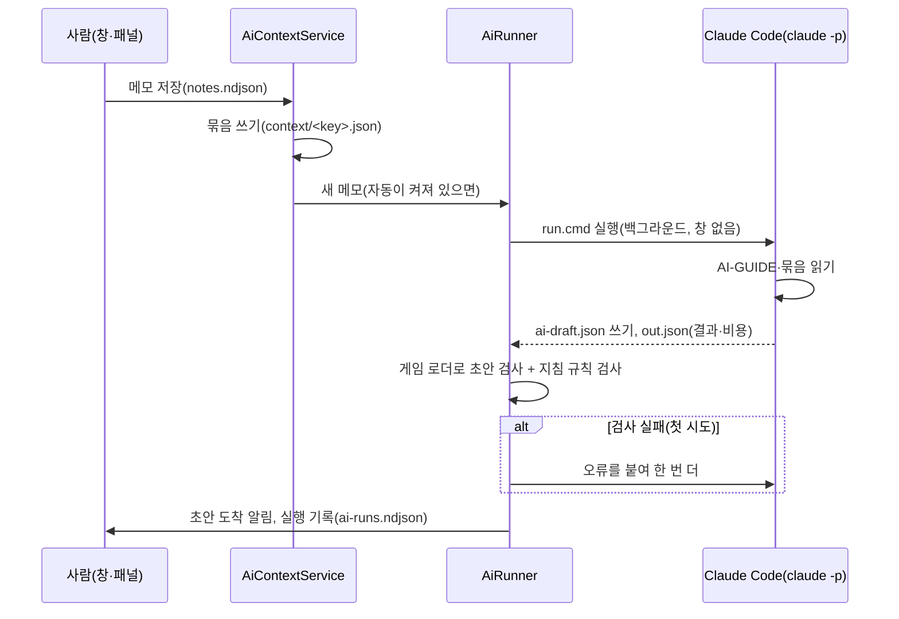

> 과거 M0~M6 구현 기록입니다. 현재 기능과 사용법은 [QA 안내](../../QA/README.md)를 참고하세요.

# M6 자동 루프

- 상태: 구현·커밋 완료, Unity 손 확인 대기
- 브랜치: `feat/autoLoop` (← `feat/sheetSync`)
- 결정(Q5, 10-10): 사용자가 "PC의 Claude Code"를 골랐다. Unity 에디터가 이 PC에 깔린 Claude Code CLI를 헤드리스(`claude -p`)로 실행해 초안을 쓴다. 메모를 저장할 때(켜 두면)와 창의 버튼으로 실행한다.
- 앞에서 받은 것:
  - AI가 읽을 곳: `PlaytestData/context/index.json`과 세팅별 묶음. 메모를 저장하면 1초 안에 에디터가 쓴다(M4 `AiContextService`).
  - AI가 쓸 곳: `Assets/Playtest/Profiles/ai-draft.json` 하나. 쓰면 묶음의 draft 칸에 검사 결과가 다시 써진다.
  - AI 작업 지침: `Docs/BalanceLoop/AI-GUIDE.md`.
  - 승격·되돌리기(M4)와 시트 반영(M5)은 사람이 버튼으로 한다. 자동 루프도 이 규칙을 바꾸지 않는다.

## 목표

메모를 저장하면 사람이 채팅으로 가지 않아도 AI가 돌아 초안 프로필을 만들고, 에디터에 "초안 도착"을 알린다. 승격은 언제나 사람이 한다.

## 흐름



## 설계

### 실행

- 실행 파일: `ai.json`의 `command`가 있으면 그것을 쓴다. 없으면 PATH의 `claude`, `%USERPROFILE%\.local\bin\claude.exe`(기본 설치), `%APPDATA%\npm\claude.cmd`(npm), WinGet 링크 순서로 찾는다. macOS·Linux는 PATH, `~/.local/bin/claude`, Homebrew 위치를 본다. Unity를 Claude Code 설치 전에 켰으면 PATH에 없을 수 있어 기본 설치 위치를 따로 본다.
- 실행마다 `PlaytestData/ai-runs/<runId>/`에 파일을 만든다(`PlaytestData/`는 git 무시).

  | 파일 | 내용 |
  | --- | --- |
  | `prompt.md` | AI에게 주는 지시(한국어). 표준 입력으로 넘긴다 |
  | `run.cmd` / `run.sh` | 실행 스크립트(Windows / macOS·Linux). 손으로 두 번 눌러 돌려도 같다 |
  | `run.json` | 실행 상태(시작 시각, 계기, 메모, 시도, 프로세스 ID, 이전 초안 해시) |
  | `out.json` | Claude Code의 JSON 결과(`result`, `is_error`, `total_cost_usd`, `num_turns`, `duration_ms`, `permission_denials`) |
  | `err.txt`, `exit.txt` | 오류 출력, 종료 코드. `exit.txt`가 생기면 끝난 것이다(임시 파일을 옮겨 만든다) |
  | `draft-before.json`, `draft-after.json` | 실행 전 초안(있었으면), AI가 쓴 초안 |
  | `done.json` | 실행 기록(아래)과 같은 내용 |

- 스크립트로 돌리는 이유: Unity가 스크립트를 다시 컴파일하거나(도메인 리로드) 꺼져도 실행은 끝까지 가고 결과가 파일에 남는다. 에디터는 다시 켜질 때 최근 실행 5개를 보고, 아직 도는 것은 이어서 지켜보고 끝난 것은 마저 처리한다.
- Windows: `cmd.exe /d /s /c ""…\run.cmd""`를 창 없이 띄운다. `call`로 부르므로 `claude.cmd`(npm)도 끝난 뒤 돌아온다. 스크립트는 ASCII만 쓰고 `chcp 65001`로 시작한다.
- 시간 제한(`timeoutSeconds`)을 넘거나 "멈추기"를 누르면 프로세스 트리를 끝낸다(`taskkill /PID … /T /F`).
- 한 번에 하나만 돈다. 도는 동안 메모가 또 들어오면 가장 최근 것 하나만 기다렸다가 이어서 돈다.

### Claude Code 옵션 (`AiRun.Arguments`)

```
claude -p "<짧은 영어 지시>" < prompt.md
  --output-format json
  --permission-mode dontAsk
  --tools Read,Edit,Write,Glob,Grep
  --allowedTools "Edit(Assets/Playtest/Profiles/ai-draft.json)"
  --disallowedTools "mcp__*" "Edit(Assets/Data/**)" "Edit(Assets/Scripts/**)" "Edit(Docs/**)" "Edit(PlaytestData/**)"
                    "Read(PlaytestData/sheet.json)" "Read(**/.env)"
  --restricted --strict-mcp-config --no-session-persistence
  --max-turns <maxTurns> --max-budget-usd <maxBudgetUsd> [--model <model>]
```

- `dontAsk`: 묻는 대신 거절한다. 미리 허락한 것(초안 파일 쓰기)과 작업 폴더 안 읽기만 된다.
- `--restricted`(Claude Code 2.1.248 이상): 사용자·프로젝트 설정(넓은 허락 규칙, 훅)을 읽지 않고, 명령 실행 도구를 빼고, 파일 도구를 작업 폴더 안으로 묶는다.
- 도구는 읽기·찾기·고치기·쓰기뿐이다. 명령 실행(Bash·PowerShell), 웹, MCP는 없다.
- 쓰기 허락은 `ai-draft.json` 한 파일이다(Edit 규칙이 Write도 다룬다). 수치 원본·코드·문서·PlaytestData는 거절 규칙이 한 번 더 막는다. 시트 토큰 파일과 `.env`는 읽지도 못한다.
- 지시 본문은 표준 입력으로 넘긴다. 명령줄에는 한글·따옴표가 들어가지 않는다.
- 막힌 시도(`permission_denials`)는 실행 기록의 경고로 남긴다.

### 결과 판정

| 상태 | 창에 보이는 말 | 뜻 |
| --- | --- | --- |
| `ok` | 초안 도착 | 초안을 새로 썼고 게임 로더 검사와 지침 규칙을 통과했다 |
| `no-draft` | 초안 없음 | 끝났지만 초안을 쓰지 않았다(AI가 "초안 없음: 이유"로 답하거나 같은 초안을 다시 썼다) |
| `invalid-draft` | 초안 검사 실패 | 초안을 썼지만 검사를 통과하지 못했다. 첫 시도면 오류를 붙여 한 번 더 한다 |
| `error` | 실패 | Claude Code가 실패했다(종료 코드, `is_error`, 로그인·한도·턴 등). `err.txt`와 결과를 보인다 |
| `timeout` / `stopped` | 시간 초과 / 멈춤 | 시간 제한을 넘었다 / 사람이 멈췄다 |
| `lost` | 결과 없음 | 결과 없이 프로세스가 사라졌다 |

- 지침 규칙(AI-GUIDE 4절): 이름 `ai-draft`, 값 3개 이하, 같은 경로 한 번, `reason` 필수, 메모가 있는 실행이면 `noteIds` 필수(오류). 값이 ×0.5~×2 밖이거나 그대로면 경고(사람이 넓히라고 했을 수 있다).
- 실행 기록 `PlaytestData/ai-runs.ndjson`(schema 1): `id`, `startedAtUtc`, `finishedAtUtc`, `trigger`(note·button·retry), `setupKey`, `noteId`, `attempt`, `retryOf`, `command`, `exitCode`, `status`, `summary`(AI 답 앞 4줄), `costUsd`, `turns`, `durationMs`, `draftWritten`, `draftValid`, `errors`, `warnings`.

### 설정 `PlaytestData/ai.json` (git 무시, PC마다)

| 칸 | 기본 | 뜻 |
| --- | --- | --- |
| `command` | "" | Claude Code 실행 파일. 비우면 찾는다 |
| `autoOnNote` | false | 메모를 저장하면 자동으로 맡긴다(창의 토글이 쓴다) |
| `model` | "" | 비우면 Claude Code 기본 모델. `sonnet`·`haiku`처럼 줄이면 싸고 빨라진다 |
| `maxTurns` | 30 | 한 번에 쓸 수 있는 턴(1~200) |
| `maxBudgetUsd` | 2 | 한 번에 쓸 수 있는 비용(달러, Claude Code가 어림한 값) |
| `timeoutSeconds` | 600 | 시간 제한(60~3600초) |
| `retry` | true | 검사 실패 때 한 번 더 |

### 창 (Test Setup "AI 조정")

초안 칸 아래에 "AI 자동 실행 · 이 PC의 Claude Code" 칸이 있다.

- 상태: 실행 중이면 흐른 초·계기·메모·시도. 끝나면 "마지막: 상태 · 시각 · 걸린 시간 · 비용 · 턴 · 계기 · 메모"와 AI의 세 줄 답, 오류, 확인할 것(배율 경고·막힌 시도).
- 버튼: "AI에게 초안 맡기기"(실행 중이면 "멈추기"), "Claude Code 확인"(위치·버전·로그인), "실행 기록"(마지막 실행 폴더).
- 토글: "메모 저장 때 자동으로 맡기기".
- "AI에게 초안 맡기기"는 지금 세팅의 묶음이 없으면 먼저 만들고, 그 세팅의 가장 최근 메모를 보게 한다.
- 초안이 도착하면 창에 "AI 초안 도착"이 뜨고 초안 칸이 새로 그려진다. 비교·반영은 M4 그대로다.

## 작업

| # | 작업 | 상태 |
| --- | --- | --- |
| T1 | 실행 계획 코드 `Playtest/AiRun.cs`: 설정, 명령줄·스크립트(따옴표), 실행 파일 찾기, 지시문, 결과 읽기, 판정, 규칙 검사, 기록 | 완료 |
| T2 | 에디터 실행기 `Editor/Playtest/AiRunner.cs`: 시작·멈추기·감시·마무리·다시 하기·대기열·다시 켜진 뒤 복구, Claude Code 확인 | 완료 |
| T3 | 연결: AiContextService(새 메모 → 실행기, 초안 검사 `TryValidateDraft`), Test Setup 창 칸 | 완료 |
| T4 | 검증: 3가지 컴파일, 헤드리스 테스트, 가짜 `claude`로 끝까지, 진짜 Claude Code로 클라우드 확인 | 완료 |
| T5 | 문서(이 문서, AI-GUIDE 8절, PLAN), 커밋, 프로젝트 문서 | 완료 |

## 결과

### 코드

| 파일 | 내용 |
| --- | --- |
| `Assets/Scripts/Playtest/AiRun.cs` | `AiRunSettings`, `AiRunRequest`(run.json), `AiRunOutput`(out.json), `AiRunRecord`(기록), `AiRun`(인자, Windows·sh 스크립트, 따옴표, 실행 파일 찾기, 지시문, 실행 폴더, 판정, 규칙, 다시 하기). `UNITY_EDITOR`에서만 컴파일된다 |
| `Assets/Scripts/Editor/Playtest/AiRunner.cs` | 실행기(위 "실행"), Claude Code 확인 |
| `Assets/Scripts/Editor/Playtest/AiContextService.cs` | 새 메모의 묶음을 쓴 뒤 `AiRunner.OnNewNote`, `TryValidateDraft` |
| `Assets/Scripts/Editor/Playtest/TestSetupWindow.cs` | "AI 자동 실행" 칸, 도착 알림 |

### 검증

- 컴파일: 개발·릴리스·에디터 모두 오류 0. 새 경고 없음.
- 헤드리스 2983개 통과(이번에 95개 추가). 설정, 인자, Windows 스크립트(줄 끝·ASCII·인자를 Windows 규칙으로 나눠 그대로 돌아오는지), 실행 파일 찾기, 지시문, 결과 읽기(배열·잡음 줄·막힌 시도), 규칙, 판정, 기록.
- 가짜 `claude`(셸 스크립트)로 끝까지 5번: 초안 도착 → 같은 초안("초안 없음") → 틀린 경로(검사 실패) → 다시 하기(지시문에 오류가 들어감) → 도착, 로그인 실패. 경로에 빈칸과 작은따옴표가 있는 폴더에서 돌렸다. 가짜가 받은 인자와 표준 입력이 만든 것과 같다.
- 진짜 Claude Code(2.1.296, 클라우드 Linux, `--model haiku`, 실제 메모·묶음)로 `run.sh`를 돌렸다.
  - 초안 도착: 28~35초, 5~6턴, $0.012. "성장 공급 25 → 12.5" 초안과 세 줄 답. git으로 보면 초안과 실행 폴더 말고는 바뀐 파일이 없다.
  - 권한 시험(지시문을 일부러 바꿈): `sheet.json` 읽기, 노드 CSV 고치기, `Docs/`에 쓰기, 레포 맨 위에 새 파일 쓰기는 모두 거절됐고, 명령 실행 도구는 없었다. 초안 파일 쓰기만 됐다. `--restricted`를 붙여도 같다.
- Windows `run.cmd`는 클라우드에서 돌려 보지 못했다. 손 확인 2~3번이 처음 돌리는 것이다.

### 손 확인 (사용자)

1. Claude Code가 없으면 설치하고 로그인한다. PowerShell에서 `irm https://claude.ai/install.ps1 | iex`를 실행하고, 새 터미널에서 `claude`를 한 번 실행해 로그인한다(Pro·Max·Team 등 Claude Code를 쓸 수 있는 계정).
2. Test Setup 창 "AI 조정" → "Claude Code 확인": 실행 파일 위치, 버전(2.1.248 이상), "로그인됨"이 보인다.
3. 세팅을 고르고 "AI에게 초안 맡기기": "실행 중 n초"가 올라가다가 끝나면 "마지막: 초안 도착"과 세 줄 답, 비용이 보이고 초안 칸이 생긴다.
   - 실패하면 칸의 오류를 보고, "실행 기록"으로 연 폴더의 `err.txt`·`out.json`을 본다. `run.cmd`를 두 번 눌러 손으로 돌려 볼 수도 있다.
4. "메모 저장 때 자동으로 맡기기"를 켜고 메모를 하나 저장한다: 같은 일이 저절로 일어난다.
5. 초안 칸에서 "초안 켜기"·"원본으로"로 비교한다(M4). 반영은 사람이 한다.

## 남은 일

- 손 확인(위).
- 실제 사용에서 걸리는 시간과 비용을 보고 기본값(모델, 턴, 비용, 시간 제한)을 고친다.
- 메모를 연달아 저장하면 실행이 이어서 돈다(가장 최근 메모 하나만 기다린다). 사용량이 부담되면 토글을 끄고 버튼으로만 쓴다.
