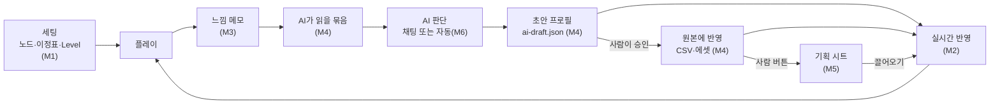
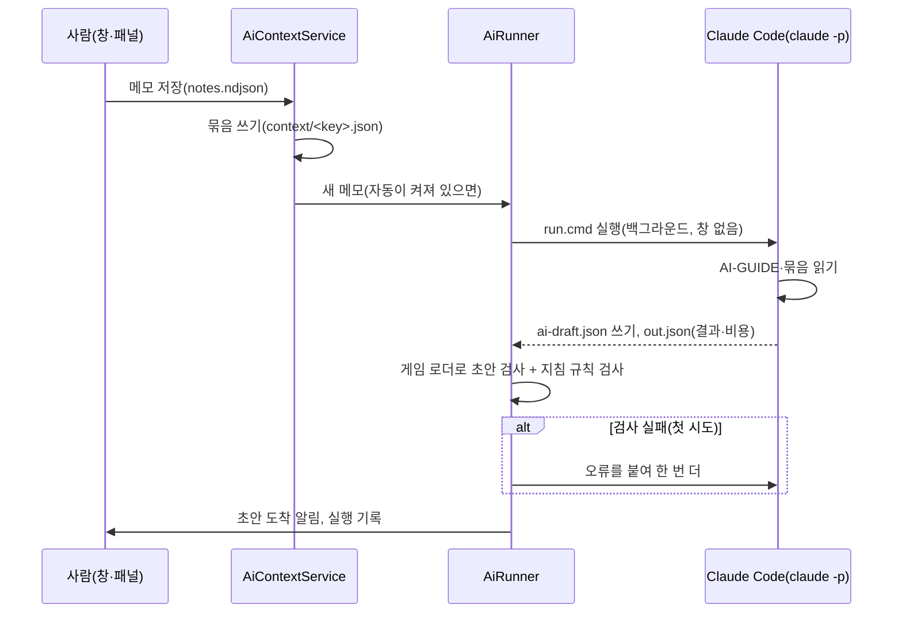

> 과거 M0~M6 구현 기록입니다. 현재 기능과 사용법은 [QA 안내](../../QA/README.md)를 참고하세요.

# 밸런스 루프 작업 정리 (M0~M6)

- 정리: 2026-10-10, 브랜치 `feat/autoLoop`(50e9a85)까지
- 대상: 이 레포에서 밸런스를 잡는 사람(기획·개발), 그리고 같은 파일을 읽는 AI
- 이 문서는 한 번에 읽는 안내서다. 자세한 내용은 각 마일스톤 문서([PLAN](PLAN.md), [M0](M0-playtest-tools.md)~[M6](M6-auto-loop.md))와 [AI 작업 지침](AI-GUIDE.md)에 있다.

## 목차

1. [한눈에 보기](#1-한눈에-보기)
2. [목적과 의도](#2-목적과-의도)
3. [무엇을 했나 (M0~M6)](#3-무엇을-했나-m0m6)
4. [사용 방법](#4-사용-방법)
5. [설계](#5-설계)
6. [구조 (코드·데이터 파일 지도)](#6-구조-코드데이터-파일-지도)
7. [다른 사람이 알아야 할 것](#7-다른-사람이-알아야-할-것)
8. [확인 현황과 남은 일](#8-확인-현황과-남은-일)
9. [브랜치와 커밋](#9-브랜치와-커밋)
10. [용어](#10-용어)

---

## 1. 한눈에 보기

정확한 상태에서 플레이하고, 느낌을 적고, AI가 그 느낌을 읽어 수치 초안을 만들면, 같은 상태로 바로 비교 플레이한다. 마음에 들면 사람이 버튼으로 원본(레포 CSV·에셋)과 기획 시트에 반영한다. 이 한 바퀴를 몇 분 안에 돈다.



| 마일스톤 | 한 줄 | 주 화면 |
| --- | --- | --- |
| M0 공용 테스트 도구 | 값만 바꾼 버전(프로필)과 원하는 시점(시나리오)으로 플레이하고, 판을 조작하고, 숫자를 본다 | 개발 패널(F1), HUD |
| M1 테스트 세팅 창 | 노드 Rank·이정표 단계·Level을 정확히 정해 바로 플레이하고, 그 판의 확정 정보를 본다 | BlackHole > Test Setup |
| M2 수치 실시간 반영 | 수치 파일이 바뀌면 창과 플레이 중인 판이 몇 초 안에 새 값이 된다 | (자동) |
| M3 플레이 메모 | 느낌을 적으면 세팅·수치 지문·판 상태와 함께 JSON 한 줄로 쌓인다 | 창의 메모 칸, 패널 메모 탭 |
| M4 AI 조정 | AI가 메모를 읽고 초안을 쓰면 비교 플레이하고, 사람이 원본에 반영하거나 되돌린다 | 창의 "AI 조정" |
| M5 기획 시트 연동 | 구글 시트와 레포 CSV를 끌어오고, 반영한 값을 시트에 쓴다 | BlackHole > Sheet Sync |
| M6 자동 루프 | 메모를 저장하면 이 PC의 Claude Code가 알아서 초안을 쓴다 | 창의 "AI 자동 실행" |

모든 도구는 에디터와 개발 빌드에만 들어간다. 출시(릴리스) 빌드에는 영향이 없다.

---

## 2. 목적과 의도

### 풀려던 문제

- 특정 노드 조합과 이정표 단계를 정확히 재현하기 어려웠다. 원하는 상태까지 직접 플레이해야 했다.
- 수치 하나를 바꿔 확인하려면 파일을 고치고, Unity로 돌아가고, 다시 그 상태까지 가야 했다.
- "빽빽하다", "지루하다" 같은 느낌이 어떤 세팅·어떤 수치에서 나왔는지 남지 않았다.
- AI에게 수치 조정을 맡기려 해도, AI가 읽을 정리된 정보와 안전하게 써 볼 자리가 없었다.
- 기획자가 정리한 구글 시트와 레포의 CSV 사본을 손으로 맞추고 있었다.

### 목표 (사용자 요청)

> 실제 수치를 기획자가 정리해 둔 시트와 실시간으로 연동하고, 특정 노드·이정표 세팅 기준의 느낌을 에디터에서 메모하면 그게 실시간으로 저장되며, AI가 그걸 읽은 뒤 의도에 맞게 수치를 바꾸게 한다.

이것을 네 가지로 나눴다.

1. **세팅**: 노드 Rank·이정표 단계·블랙홀 Level을 정확히 정하고 그 상태로 바로 플레이한다(M0·M1).
2. **수치 연동**: 수치(노드 CSV, 전투 기본값 에셋, 기획 시트)가 바뀌면 게임과 에디터가 바로 따라온다(M2·M5).
3. **메모**: 그 세팅 기준의 느낌을 적으면 그때의 세팅·수치·판 상태와 함께 JSON으로 바로 쌓인다(M3).
4. **AI 조정**: AI가 메모와 수치를 읽고 의도에 맞게 수치 초안을 만든다. 바뀐 값은 바로 반영되고, 기록이 남고, 되돌릴 수 있다(M4·M6).

### 지킨 원칙 (의도)

| 원칙 | 왜 | 어디에 드러나나 |
| --- | --- | --- |
| AI는 초안까지만 쓴다. 원본·시트 반영은 사람 버튼이다 | 원인 모를 변경, 남의 수정 덮어쓰기를 막는다 | `ai-draft.json` 하나만 쓰기, 승격·시트 반영 버튼, M6 권한 제한 |
| 게임과 같은 길로 계산한다 | 창에 보이는 값이 곧 판의 값이어야 믿고 쓴다 | 확정 정보·검사·흐름 모두 게임 로더와 판 조립을 그대로 부른다 |
| 같은 상태에는 같은 열쇠 | 메모·묶음·기록을 정확히 이어 붙인다 | 세팅 키(단계·Level·노드), 수치 지문(값의 해시) |
| 모든 변경은 기록하고 되돌릴 수 있다 | 실험을 겁내지 않게 | `changes.ndjson`, 되돌리기, 초안 보관, git |
| 틀리면 아무것도 바꾸지 않는다 | 반쯤 적용된 상태를 남기지 않는다 | 프로필 패치, 승격, 시트 쓰기 모두 전부 아니면 없음 |
| 사람과 AI가 같은 파일을 읽는다 | 채팅·자동 실행·사람이 같은 근거로 판단한다 | 레포 안 `PlaytestData/`의 JSON |
| 출시 빌드에 영향 없음 | 테스트 도구가 실제 게임·통계를 오염시키지 않게 | `#if UNITY_EDITOR || DEVELOPMENT_BUILD`, 조작한 판은 통계에 `+test` |

---

## 3. 무엇을 했나 (M0~M6)

### M0 공용 테스트 도구 — `feat/playtestTools`

값만 바꾼 버전과 원하는 시점으로 빠르게 플레이하고, 판을 조작하고, 숫자를 보며 느낌을 적는다. 조작한 판은 통계에서 구분한다.

- **판 조작 훅** `Core/Battle/BattleCheats.cs`: 적 소환(종류·등급·성질·크기), 치우기, 이동 배율, EXP·Level 올리기, 시간 추가·고정. 게임 규칙을 새로 만들지 않고 판이 원래 쓰는 길(출현·EXP·제한 시간)에 값을 넣는다. 더한 시간은 통계에 세지 않는다.
- **밸런스 프로필** `Playtest/BalanceProfile.cs`, `BalanceProfilePatcher.cs`: 원본 위에 덧씌우는 경로·값 패치 묶음(JSON). 로더 앞에서 적용해 원래 검증을 그대로 거친다. 하나라도 틀리면 아무것도 바꾸지 않는다.
- **시나리오** `Playtest/PlaytestScenario.cs`, `UI/Flow/ScreenFlow.Playtest.cs`: 성장도·Gold·노드·자동 구매 예산·시작 Level·시드·시간 고정을 정해 판을 바로 시작한다. 저장을 불러올 때와 같은 검사를 거친다.
- **저장 보호** `PlaytestSession`, `Save/ProgressStore.cs`: 프로필마다 저장 폴더를 따로 쓰고, 시나리오로 시작한 실행은 저장하지 않는다.
- **개발 패널** `Playtest/PlaytestPanel.cs`: F1 또는 세 손가락 터치. 탭은 시나리오·프로필·판·적·메모. 배속도 여기서 바꾼다.
- **HUD** `Playtest/PlaytestHud.cs`: 시간·Level·처치·Gold·5초 속도·종류별 적 수.
- **통계 표시** `Playtest/ContentTag.cs`, `Battle/Analytics/BattleAnalytics.cs`: 전투 요약의 contentVersion = 프로필 이름. 조작했거나 시나리오로 만든 판은 `+test`.
- **예시**: 프로필 3개(`golden-x5`, `golden-x10`, `time-18`), 시나리오 5개, `PlaytestLibrary` 에셋(개발 빌드에 넣을 JSON 목록, 빌드 전에 자동으로 다시 모은다).

### M1 테스트 세팅 창 — `feat/testSetup`

정확히 특정 노드(Rank)를 사고, 정확한 이정표 단계와 블랙홀 Level에 닿은 상태를 만들어 바로 플레이한다.

- 전제: 노드 Rank와 이정표 단계만 정하면 적·Breaker·스탯이 모두 정해진다. 그래서 창은 이 둘과 판 안의 시작 Level만 고치고, 나머지는 계산해 "확정 정보"로 보인다.
- **창** `Editor/Playtest/TestSetupWindow.cs` (메뉴 BlackHole > Test Setup): 노드 트리 캔버스(클릭 +1, Ctrl+클릭 −1, Delete 0), 세팅 파일 저장·불러오기, 이정표 단계·Level·Gold·시드·시간 고정, 예산으로 싼 것부터 사기, 찾기, Undo.
- **확정 정보** `Playtest/TestSetupPreview.cs`: 게임과 같은 길로 판을 조립해 읽는다(검사 → 노드 스탯 → 판 생성 → 시작 Level까지 Level업). 블랙홀·Breaker 12개 수치·적 종류별 구성·바뀐 수치·총 비용·게임 순서로 못 사는 노드.
- **바로 플레이** `Playtest/TestSetupLaunch.cs`: ▶를 누르면 세팅을 맡기고 플레이 모드에 들어가, 타이틀을 건너뛰고 그 세팅으로 판을 시작한다. 플레이 중에는 "지금 판에 적용", "지금 게임에서 가져오기".
- 덤: 노드 캔버스가 Ctrl+클릭을 창에 넘기지 않던 문제를 고쳤다(`Editor/Nodes/NodeGridCanvas.cs`).

### M2 수치 실시간 반영 — `feat/liveData`

수치 파일(노드 CSV 4개, 전투 기본값 에셋, 밸런스 프로필 JSON)이 디스크에서 바뀌면, 사람이 고쳤든 AI가 고쳤든 몇 초 안에 반영한다.

- **파일 감시** `Editor/Playtest/LiveDataWatcher.cs`: `Assets/Data`, `Assets/Playtest/Profiles`, `Assets/Playtest/Scenarios`의 `.csv`·`.asset`·`.json`을 감시한다. 0.3초 모았다가 Unity에 직접 가져오게(ImportAsset) 하고, 게임 로더로 검사한 뒤 신호를 낸다. Unity가 플레이 중이어도 가져온다.
- **신호** `Playtest/LiveDataSignal.cs`: 무엇이 바뀌었고, 검사를 통과했고, 새 지문이 무엇인지.
- **수치 지문** `Playtest/ContentFingerprint.cs`: 프로필까지 적용한 콘텐츠 값의 SHA-1 앞 8자리. 같은 값이면 어디서나 같다. 원본 지문은 `9a787fff`.
- **반응**:
  - 창은 다시 계산하고 "수치 바뀜 · 지문 a → b"를 알린다. 오류면 이전 값을 유지하고 오류를 보인다.
  - 플레이 중이면 같은 세팅·같은 시드로 판을 다시 시작한다(Q1). 패널 판 탭에서 끌 수 있다.
  - HUD 첫 줄에 지문이 보인다.

### M3 플레이 메모 — `feat/feelNotes`

특정 세팅 기준의 느낌을 에디터(창)나 게임(패널)에서 적으면, 그 순간의 세팅·수치 지문·판 상태와 함께 JSON 한 줄로 바로 쌓인다.

- **파일** `PlaytestData/notes.ndjson`(레포 안, git 무시, 덧붙이기만). 개발 빌드는 기기의 `persistentDataPath/playtest/`.
- **한 줄에 담는 것**: 세팅(단계·시작 Level·시드·노드), 세팅 키, 프로필·지문, 판 상태(흐른·남은 시간, Level, EXP, 처치, Gold, 5초 속도, 종류별 적 수, 조작 여부), 난이도 −2~+2, 재미 1~5, 태그, 느낌, 의도.
- **세팅 키**: `stage;level;nodes(id:rank 정렬)`의 SHA-1 앞 8자리. 이름이 달라도 같은 상태면 같은 키다.
- **자체 JSON 도구** `Playtest/PlaytestJson.cs`: Unity JsonUtility가 null과 순서 있는 객체를 다루지 못해서 만들었다. 메모·묶음·기록이 모두 이것을 쓴다.
- **화면**: 창의 메모 칸과 이 세팅의 최근 메모 10개(이전 수치로 적은 메모는 흐리게), 패널의 메모 탭. 판 상태 숫자는 `HudSnapshot` 하나에서 HUD와 메모가 같이 쓴다.

### M4 AI 조정 — `feat/aiTuning`

AI가 메모·세팅·확정 정보·현재 수치를 읽고 의도에 맞게 수치 초안을 쓴다. 비교 플레이한 뒤 사람이 원본에 반영하거나 되돌린다.

- **AI 묶음** `Playtest/AiContext.cs`, `Editor/Playtest/AiContextService.cs` → `PlaytestData/context/<세팅 키>.json`과 `index.json`.
  - 메모 저장, 수치·초안 변경, 창 버튼 때 에디터가 쓴다.
  - 담는 것: 세팅, 원본 지문, 메모 원문(최근 20개), 확정 정보, 흐름, 산 노드의 비용·효과와 경로, 노드가 아닌 모든 경로의 지금 값(173개), 초안 검사 결과, 최근 변경 10개.
  - **흐름** `Playtest/PlaytestSimulation.cs`: AI는 Unity를 못 돌리므로, 사람 없이 같은 시드로 판을 돌린 숫자를 넣었다. 조준 (0,4) 고정, 1/60초씩, 2초마다 Level·적 수·`cover`(출현 띠 넓이 대비 적 원 넓이 합). 원본과 초안을 비교하는 기준선으로만 쓴다.
- **AI 초안** `Assets/Playtest/Profiles/ai-draft.json`(git 무시): 밸런스 프로필 형식에 패치마다 `reason`·`noteIds`를 더했다.
- **창 "AI 조정"**: 초안의 `경로: 원본 → 초안 (×배율)`과 이유, "초안 켜기"·"원본으로"(플레이 중이면 같은 세팅·같은 시드로 다시 시작), "초안을 원본에 반영", "초안 버리기", "AI 묶음 만들기", 최근 변경과 "되돌리기".
- **승격(원본 반영)** `Playtest/ProfileTargets.cs`, `Playtest/NodeSheetEdits.cs`, `Editor/Playtest/ProfilePromoter.cs`: 프로필 경로 → 원본 칸(노드 CSV 행, 에셋 필드). CSV는 그 칸만 바꾸고 시트 서식(천 단위 쉼표, 따옴표, 표시 칸 "+25%")을 지킨다. 에셋은 SerializedObject로 고친다.
- **변경 기록** `Playtest/ChangeRecord.cs`, `Playtest/PlaytestChanges.cs` → `PlaytestData/changes.ndjson`: 이전·이후 값, 이유, 메모 ID, 지문 앞뒤. 반영한 초안은 `PlaytestData/drafts/`로 옮긴다.
- **되돌리기**: 기록의 이전 값으로 돌린다. 그 뒤에 값이 또 바뀌었으면 하지 않는다.
- **AI 작업 지침** [AI-GUIDE.md](AI-GUIDE.md): 읽을 곳, 판단 순서, 손잡이 표, 초안 제한(값 3개 이하, ×0.5~×2, 이유·메모 필수), 알리는 법.
- 프로필 경로에 출현 띠 `placement/minDistance|maxDistance`, 메모 태그 "너무 빽빽함·듬성함"을 더했다.
- **첫 실제 루프**: 메모 "소행성이 빽빽함 / 사이로 빈 공간이 보였으면" → 초안 `growth.asteroids-01·02` 25 → 12.5(Level업 성장 공급 50% → 25%). 같은 시드 흐름에서 Lv3 소행성 250 → 172, cover 0.53 → 0.37. 초안 지문 `6595b75b`.

### M5 기획 시트 연동 — `feat/sheetSync`

기획자가 정리한 구글 시트 `BlackHole_Node_Data`와 레포 CSV를 맞춘다. 노드 수치의 원본은 시트이고, 레포 CSV는 그 사본이다(Q4).

- **시트 쪽 웹 앱** [`sheet-sync/BlackholeSheetSync.gs`](sheet-sync/BlackholeSheetSync.gs): 시트에 붙이는 Apps Script. POST(JSON) + 토큰.
  - `ping`: 시트 이름과 탭 4개 확인.
  - `read`: 탭을 시트의 "CSV 다운로드"와 같은 모양으로 준다(같은 시트면 레포 CSV와 바이트까지 같다).
  - `write`: NodeCost의 `Cost`, NodeEffects의 `Value`(+표시)만, 지금 값이 기대값일 때만 한 번에 쓴다.
- **에디터 창** `Editor/Playtest/SheetSyncWindow.cs`, `SheetSync.cs` (메뉴 BlackHole > Sheet Sync):
  - **시트에서 끌어오기**: 행 단위 차이(`SheetDiff`) → 게임과 같은 검사(`NodeSheetCheck`) → 시트에 안 옮긴 레포 변경 경고 → 덮어쓰기 → `pull` 기록.
  - **시트에 반영**: 아직 시트에 안 옮긴 반영·되돌리기 기록을 칸마다 합쳐(`SheetSyncPlan`) 시트에 쓰고 `sheet` 기록을 남긴다.
  - **자동 끌어오기**(기본 꺼짐): 30초마다, Unity가 앞에 있을 때, 잃을 것이 없을 때만 덮는다.
- **네트워크** `Playtest/SheetClient.cs`: Apps Script의 302 넘김을 직접 따라간다. 시간 초과 30초. 로그인 페이지 응답을 알아보고 안내한다. 에디터 전용.
- **실제 시트에서 고친 것**: 시트에 수식이 300~1500행까지 미리 깔려 있어 빈 행(`,,,,`)이 수백 개 붙던 문제를 클라이언트에서 끝 빈 행을 빼도록 고쳤다.

### M6 자동 루프 — `feat/autoLoop`

메모를 저장하면 채팅으로 가지 않아도 이 PC의 Claude Code CLI가 돌아 초안을 쓰고, 에디터에 "AI 초안 도착"을 알린다(Q5). 승격은 그대로 사람이 한다.

- **실행 계획** `Playtest/AiRun.cs`(Unity와 무관한 순수 코드): 설정, 명령줄 인자, Windows `run.cmd`·sh 스크립트, 실행 파일 찾기, 지시문, 결과 읽기, 판정, 지침 규칙 검사, 기록.
- **실행기** `Editor/Playtest/AiRunner.cs`: 창 없이 백그라운드 실행, 1초마다 감시, 시간 제한·멈추기, 검사 실패 때 한 번 더, 한 번에 하나(기다리는 메모는 가장 최근 것 하나), 도메인 리로드·에디터 재시작 뒤 이어 보기, "Claude Code 확인".
- **연결**: `AiContextService`가 새 메모의 묶음을 쓴 뒤 실행기에 알린다. `TryValidateDraft`로 초안을 게임 로더로 검사한다.
- **창** "AI 자동 실행 · 이 PC의 Claude Code" 칸: 맡기기·멈추기·확인·실행 기록 버튼, "메모 저장 때 자동으로 맡기기" 토글, 상태·결과·비용, 도착 알림.
- **권한**: AI가 쓸 수 있는 파일은 `ai-draft.json` 하나. 명령 실행·웹·MCP 없음, 수치 원본·코드·문서·`PlaytestData` 쓰기 거절, 시트 토큰·`.env` 읽기 거절, 사용자 설정·훅 무시(`--restricted`).

---

## 4. 사용 방법

### 4.1 처음 한 번 (PC마다)

1. **Unity**: 프로젝트를 열고 컴파일이 끝나기를 기다린다. 메뉴에 **BlackHole > Test Setup**, **BlackHole > Sheet Sync**가 있으면 된다.
2. **기획 시트 웹 앱**(시트 연동을 쓸 때, 시트당 한 번): [M5 문서 "설치"](M5-sheet-sync.md#설치-사람이-한-번)를 따른다. 요약:
   1. 구글 시트 `BlackHole_Node_Data` → 확장 프로그램 > Apps Script → 새 스크립트 파일에 `BlackholeSheetSync.gs` 내용을 붙여 넣고 저장한다.
   2. 함수 `bhSyncSetupToken`을 실행해 토큰을 받는다.
   3. 배포 > 새 배포 > 웹 앱(실행 사용자 "나", 액세스 "모든 사용자") → `…/exec` 주소를 받는다.
   4. Unity **Sheet Sync** 창에 주소·토큰을 넣고 "저장" → "연결 확인"에서 "탭 4/4"를 본다.
   - 이미 설치된 시트를 쓰는 사람은 4번만 한다(주소·토큰은 담당자에게 받는다).
3. **Claude Code**(자동 실행을 쓸 때): PowerShell에서 `irm https://claude.ai/install.ps1 | iex` → 새 터미널에서 `claude`를 한 번 실행해 로그인한다(Claude Code를 쓸 수 있는 계정이 필요하다). Test Setup 창 "AI 조정"의 "Claude Code 확인"에서 버전(2.1.248 이상)과 "로그인됨"을 본다.

### 4.2 매일 쓰는 한 바퀴

1. **세팅**: BlackHole > Test Setup에서 노드를 클릭해 Rank를 정하고, 이정표 단계와 블랙홀 Level을 고른다. 오른쪽 "확정 정보"에서 적 구성·Breaker 수치를 본다. 필요하면 "다른 이름으로" 저장한다(`Assets/Playtest/Scenarios/`).
2. **플레이**: "▶ 이 세팅으로 플레이". 타이틀 없이 그 세팅으로 판이 시작한다. HUD 첫 줄에 세팅 이름·프로필·지문이 보인다.
3. **메모**: 창의 "메모" 칸이나 게임의 개발 패널(F1) 메모 탭에서 난이도·재미·태그·느낌·**의도**(어떻게 되었으면 하는지)를 적고 저장한다. 의도가 AI 판단에서 가장 중요하다.
4. **AI 초안**: 셋 중 하나.
   - 자동: 창의 "메모 저장 때 자동으로 맡기기"를 켜 두면 3에서 저장할 때 바로 돈다.
   - 버튼: 창 "AI 조정"의 "AI에게 초안 맡기기".
   - 채팅: Claude에게 "PlaytestData의 최근 메모를 읽고 AI-GUIDE대로 초안을 써 줘"라고 한다.
   - 끝나면 창에 "AI 초안 도착"과 세 줄 요약(무엇을 / 왜 / 예상), 비용이 보인다.
5. **비교**: 초안 칸의 "초안 켜기"와 "원본으로"를 번갈아 누른다. 플레이 중이면 같은 세팅·같은 시드로 판이 다시 시작해 같은 배치로 비교된다.
6. **반영**: 마음에 들면 플레이를 멈추고 "초안을 원본에 반영". 노드 CSV·에셋의 그 칸만 바뀌고 변경 기록이 남는다. `git diff`로 확인하고 커밋한다.
7. **시트에 반영**: 노드 값을 반영했다면 Sheet Sync 창의 "시트에 반영"으로 기획 시트에 옮긴다.
8. **되돌리기**: 창의 변경 기록에서 "되돌리기". 노드 값이었다면 다시 "시트에 반영"한다.

### 4.3 기획자가 시트를 고쳤을 때

- Sheet Sync 창 "시트에서 끌어오기" → 차이 확인 → 덮어쓰기. 게임 검사에 실패하면 덮지 않는다.
- "자동 끌어오기"를 켜 두면 30초마다 저절로 가져온다(잃을 것이 있으면 보류하고 알린다).
- 덮어쓰면 M2가 바로 반영한다. 플레이 중이면 같은 세팅·같은 시드로 다시 시작한다.
- 끌어온 CSV는 커밋한다. 그래야 시트의 그 시점 값이 git에 남는다.

### 4.4 개발 패널 (F1, 폰은 세 손가락 터치)

| 탭 | 하는 일 |
| --- | --- |
| 시나리오 | 시나리오·세팅을 골라 "판 시작" 또는 "업그레이드 화면으로", 파일 다시 읽기 |
| 프로필 | 밸런스 프로필을 골라 "적용"(같은 세팅·같은 시드로 다시 시작), 파일 다시 읽기 |
| 판 | 패널을 열면 판 멈춤, "수치가 바뀌면 지금 세팅으로 다시 시작" 토글, HUD 켜기·위치, 배속, +10초·+60초, 시간 고정, Level +1, 판 끝내기(결산) |
| 적 | 종류·등급·성질·크기를 골라 N마리 소환, 모두 치우기, 적 이동 배율 |
| 메모 | 난이도·재미·태그·느낌·의도 저장(그 판의 세팅과 판 상태가 같이 남는다), 폴더 열기 |

배속을 1이 아니게 하거나 판을 조작하면 그 판은 통계에 `+test`로 남는다.

### 4.5 개발 빌드(폰)

- 프로필·시나리오는 빌드에 든 것(`PlaytestLibrary`)과 기기 폴더 `persistentDataPath/playtest/{profiles,scenarios}`를 함께 읽는다. 같은 이름이면 기기 파일이 이긴다. 빌드 없이 `adb push`로 JSON만 넣어 값을 바꿔 볼 수 있다.
- 메모는 기기의 `persistentDataPath/playtest/`에 쌓인다. `adb pull`로 꺼낸다.
- 수치 감시(M2), 시트 연동(M5), 자동 실행(M6)은 에디터 전용이다.

### 4.6 파일을 직접 다룰 때

- **프로필 JSON 예**:
  ```json
  { "name": "golden-x5", "note": "황금 배율 ×50 → ×5",
    "patches": [ { "path": "enemy/asteroid/trait/golden/multiplier", "value": 5 } ] }
  ```
- **경로 문법**(`BalanceProfilePatcher.cs` 머리 주석):
  ```
  battle/<timeLimit|killTimeBonus>
  breaker/<damage|interval|radius|critChance|critDamage|moon…|comet…|planetBonusDamage|starBonusDamage>
  placement/<minDistance|maxDistance>
  enemy/<종류>/<moveSpeed|radius|radiusStep|spawnPeriod|rainCount>
  enemy/<종류>/tier/<등급>/<hp|gold|exp>
  enemy/<종류>/trait/<성질>/<칸>
  supply/<종류>/count
  growth/levelExp/<Level>
  growth/milestone/<번호>/<level|targetGold|fieldScale>
  node/<노드 ID>/<Rank>/cost
  node/<노드 ID>/<Rank>/<StatId>
  ```
- **자동 실행 설정** `PlaytestData/ai.json`: `command`(비우면 찾는다), `autoOnNote`, `model`(비우면 기본, `sonnet`·`haiku`로 줄이면 싸다), `maxTurns` 30, `maxBudgetUsd` 2, `timeoutSeconds` 600, `retry`.
- **시트 설정** `PlaytestData/sheet.json`: `endpoint`, `token`, `tabs`(탭 이름이 다를 때), `csv`(웹 앱 없이 읽기만), `autoPull`, `autoPullSeconds`.

---

## 5. 설계

### 5.1 결정 기록 (요약)

| 결정 | 내용 | 이유 |
| --- | --- | --- |
| 밸런스 프로필 | 원본 위에 덧씌우는 JSON. 판의 contentVersion에 이름을 남기고, 조작한 판은 `+test` | 원본을 지키며 A/B 비교 |
| 저장 보호 | 프로필마다 저장을 따로, 시나리오 실행은 저장 안 함 | 테스트 값이 실제 저장을 덮지 않게 |
| 세팅의 범위 | 노드 Rank·이정표 단계·블랙홀 Level만 정하고 나머지는 계산 | 이 둘이 정해지면 판이 모두 정해진다 |
| 세팅 = 시나리오 | 한 형식(시나리오 JSON) | 창과 패널이 같은 파일을 쓴다 |
| Q1 플레이 중 수치 변경 | 같은 세팅·같은 시드로 장면을 다시 시작. 지문이 같으면 안 함 | 판 구성은 시작 때 굳으므로 다시 시작이 빠짐없는 길 |
| 수치 지문 | 패치까지 적용한 값의 공개 필드를 풀어 쓴 글의 SHA-1 앞 8자리 | 값이 같으면 어디서나 같고, 객체 참조에 흔들리지 않는다 |
| 파일 감시 | 디스크 감시(FileSystemWatcher) 하나. AssetPostprocessor 안 씀 | Unity 저장도 잡히고, 스스로 부른 가져오기가 다시 신호를 내는 고리를 피한다 |
| Q2 메모 위치 | 레포 `PlaytestData/notes.ndjson`(git 무시), 덧붙이기만 | AI가 레포에서 바로 읽는다 |
| JSON 도구 | 자체 `PlaytestJson` | JsonUtility는 null·순서 있는 객체를 못 다룬다 |
| Q3 AI 변경 방식 | AI는 초안 프로필만. 비교 뒤 사람이 버튼으로 승격, 기록으로 되돌리기 | 원본과 나란히 비교되고, 에셋 YAML을 글로 고치지 않는다 |
| 흐름 숫자 | AI 묶음에 사람 없이 돌린 흐름을 넣는다 | AI는 Unity를 못 돌린다. 같은 시드 비교 숫자가 필요하다 |
| 승격의 CSV 서식 | 그 칸만 고치고 시트 서식을 지킨다 | 시트에서 다시 내려받은 CSV와 줄 단위로 비교되게 |
| Q4 시트 | 노드 수치 원본은 구글 시트. 읽기·쓰기 모두 Apps Script 웹 앱(토큰) | 설치 하나로 읽기·쓰기. 웹 게시는 시트를 공개하고 캐시로 늦다 |
| 시트 쓰기 범위 | NodeCost.Cost·NodeEffects.Value(+표시)만, 기대값이 맞을 때만, 사람 버튼 | 시트 구조는 기획자가 지킨다. 남의 변경을 덮지 않는다 |
| 끌어오기 | 행 단위 비교, 게임 검사 통과 때만 덮는다. 자동은 잃을 것이 없을 때만 | 깨진 시트 값이나 시트에 안 옮긴 변경을 조용히 잃지 않게 |
| Q5 자동 실행 | 에디터가 이 PC의 Claude Code CLI를 백그라운드로. 버튼과 "메모 저장 때 자동"(기본 꺼짐) | 채팅으로 가지 않고 가장 빨리 돈다 |
| 자동 실행 권한 | 초안 한 파일만 쓰기, 결과를 게임 로더·지침 규칙으로 다시 검사, 실패하면 한 번만 다시 | 사람이 없는 실행이다 |
| 실행 방식 | 실행 폴더의 스크립트(run.cmd)로 돌리고 결과를 파일로 받는다 | 도메인 리로드·에디터 종료에도 결과를 잃지 않는다 |

### 5.2 핵심 장치

**같은 상태를 잇는 열쇠 두 개**

| 열쇠 | 만드는 법 | 쓰는 곳 |
| --- | --- | --- |
| 세팅 키 (8자) | `stage;level;nodes(id:rank 정렬)`의 SHA-1 | 메모 묶기, AI 묶음 파일 이름, 변경 기록의 근거 세팅 |
| 수치 지문 (8자) | 패치까지 적용한 콘텐츠 값의 SHA-1 | HUD, 창 제목, 메모(어떤 수치로 플레이했나), 변경 기록 앞뒤, "이전 수치" 표시 |

**게임과 같은 길**: 확정 정보(`TestSetupPreview`), 프로필 적용(`GameContentLoader` 앞 패치), 감시 검사(`GameContentLoader.Load`), 끌어오기 검사(`NodeSheetCheck`), 초안 검사(`AiContextService.TryValidateDraft`), 흐름(`PlaytestSimulation`)이 모두 게임의 로더와 판 조립을 그대로 부른다. 따로 만든 계산이 없어서 창의 숫자와 판의 숫자가 갈라지지 않는다.

**전부 아니면 없음**: 프로필 패치, 승격, 시트 쓰기, 끌어오기 모두 먼저 전부 검사하고, 하나라도 틀리면 아무것도 바꾸지 않는다.

**변경 기록 한 줄** (`PlaytestData/changes.ndjson`, schema 1)

| kind | 언제 | author / appliedBy |
| --- | --- | --- |
| `promote` | 초안을 원본에 반영 | ai / human |
| `revert` | 되돌리기(`revertOf`) | 되돌린 것의 author / human |
| `pull` | 시트에서 끌어옴 | sheet / human·auto |
| `sheet` | 시트에 반영(`syncOf`) | — / human |

- 공통 칸: 패치(경로, 원본 칸, 이전·이후 값, 이유, 메모 ID), 지문 앞뒤, 세팅 키, 초안 보관 위치, 요약.
- **미반영** = 노드 경로가 있는 promote·revert 가운데 뒤의 pull·sheet 기록 `syncOf`에 든 적 없는 것. 끌어오기 경고와 시트 반영이 이것을 쓴다.

**AI 묶음의 칸** (`PlaytestData/context/<세팅 키>.json`): `setup`, `content`, `notes`, `report`, `simulation`, `nodes`, `values`, `draft`, `changes`. 자세한 뜻은 [AI-GUIDE 2절](AI-GUIDE.md#2-묶음의-칸).

**자동 실행의 결과 상태**: `ok`(초안 도착), `no-draft`(초안 없음), `invalid-draft`(검사 실패 → 첫 시도면 한 번 더), `error`(Claude Code 실패), `timeout`, `stopped`, `lost`(결과 없이 사라짐). 기록은 `PlaytestData/ai-runs.ndjson`.

### 5.3 자동 실행(M6) 흐름



- 실행마다 `PlaytestData/ai-runs/<runId>/`에 `prompt.md`(지시, 표준 입력으로 넘김), `run.cmd`, `run.json`(상태), `out.json`, `err.txt`, `exit.txt`(생기면 끝), `draft-before/after.json`, `done.json`이 남는다.
- Claude Code 옵션: `-p … --output-format json --permission-mode dontAsk --tools Read,Edit,Write,Glob,Grep --allowedTools "Edit(Assets/Playtest/Profiles/ai-draft.json)" --disallowedTools "mcp__*" "Edit(Assets/Data/**)" "Edit(Assets/Scripts/**)" "Edit(Docs/**)" "Edit(PlaytestData/**)" "Read(PlaytestData/sheet.json)" "Read(**/.env)" --restricted --strict-mcp-config --no-session-persistence --max-turns N --max-budget-usd X [--model M]`.
- 한 번에 하나만 돈다. 도는 동안 들어온 메모는 가장 최근 것 하나만 기다린다.

---

## 6. 구조 (코드·데이터 파일 지도)

### 6.1 층

```
Core (asmdef, 순수 게임 규칙)
  └ Core/Battle/BattleCheats.cs ............ 판 조작 훅 (에디터·개발 빌드만)

Assembly-CSharp / Assets/Scripts/Playtest (에디터·개발 빌드만, 일부는 에디터만)
  ├ 프로필·시나리오·세션 ..... BalanceProfile, BalanceProfilePatcher, PlaytestScenario, PlaytestSession,
  │                            PlaytestLibrary, PlaytestFiles, ContentTag
  ├ 화면 .................... PlaytestPanel(F1), PlaytestHud, TestSetupLaunch
  ├ 계산 .................... TestSetupPreview, ContentFingerprint, PlaytestSimulation
  ├ 메모·JSON ............... PlaytestJson, FeelNote, PlaytestNotes
  ├ AI 묶음·승격·기록 ....... AiContext, ProfileTargets, NodeSheetEdits, ChangeRecord, PlaytestChanges
  ├ 신호 .................... LiveDataSignal (에디터)
  ├ 시트 .................... SheetClient, SheetDiff, SheetSyncPlan, SheetSyncConfig (에디터)
  └ 자동 실행 ............... AiRun (에디터)

Assembly-CSharp-Editor / Assets/Scripts/Editor/Playtest (에디터만)
  ├ TestSetupWindow ......... 테스트 세팅 창 (M1·M3·M4·M6 화면)
  ├ LiveDataWatcher ......... 파일 감시 (M2)
  ├ AiContextService ........ AI 묶음 쓰기, 새 메모 알림, 초안 검사 (M4·M6)
  ├ ProfilePromoter ......... 승격·되돌리기·초안 버리기 (M4)
  ├ SheetSync, SheetSyncWindow  시트 연동 (M5)
  ├ AiRunner ................ 자동 실행기 (M6)
  └ PlaytestLibraryBuildStep  빌드 전 PlaytestLibrary 다시 모으기

구글 시트 (Apps Script)
  └ Docs/BalanceLoop/sheet-sync/BlackholeSheetSync.gs

바깥 프로그램
  └ Claude Code CLI (이 PC에 설치, M6)
```

게임 코드에서 손댄 곳(모두 테스트 도구가 부를 때만 다르게 동작한다):

| 파일 | 더한 것 |
| --- | --- |
| `Battle/GameBootstrap.cs` | PlaytestLibrary 칸, 프로필 적용과 프로필별 저장, 판의 콘텐츠 표시 |
| `Battle/GameContentLoader.cs` | 프로필 패치를 로더 앞에 넣는 자리 |
| `Battle/BattleSystem.cs` | 다음 판 시드·마지막 판 시드(같은 시드로 다시 하기) |
| `Battle/Analytics/BattleAnalytics.cs` | 전투 요약 contentVersion(프로필 이름, `+test`) |
| `Core/Battle/Session/GameSession.cs`, `Time/TimeLimitRule.cs`, `World/EnemySupply.cs`, `World/World.cs` | 판 조작 훅이 쓰는 길: 시간 고정·추가(통계에 안 셈), 소환, 치우기, 이동 배율 |
| `Save/ProgressStore.cs` | 테스트 세션(시나리오 실행)은 저장하지 않기 |
| `Battle/GameContentSetup.cs`, `Nodes/NodeContentSource.cs` | 에디터 도구가 고칠 에셋·CSV에 닿는 내부 접근 |
| `UI/Flow/ScreenFlow.Playtest.cs` | 테스트 판 시작 흐름(원래 시작과 같은 길) |
| `Editor/Nodes/NodeGridCanvas.cs` | Ctrl+클릭을 창에 넘기기 |
| `Scenes/GameScene.unity` | GameBootstrap에 PlaytestLibrary 연결 |

### 6.2 컴파일 범위

| 범위 | 가드 | 들어가는 것 |
| --- | --- | --- |
| 출시 빌드 | — | 테스트 도구 없음. `PlaytestLibrary` 클래스만 장면 참조 때문에 남는다(쓰지 않는다) |
| 개발 빌드 | `DEVELOPMENT_BUILD` | 패널, HUD, 프로필, 시나리오, 판 조작, 메모 |
| 에디터 | `UNITY_EDITOR` | 위 전부 + 창, 감시, AI 묶음, 승격, 시트 연동(네트워크·토큰), 자동 실행 |

### 6.3 데이터 파일

| 경로 | 무엇 | git |
| --- | --- | --- |
| `Assets/Data/NodeTable/*.csv` | 노드 수치 4개(UpgradeStats·Nodes·NodeCost·NodeEffects). 원본은 구글 시트 | 커밋 |
| `Assets/Data/*.asset`, `Assets/Data/Enemies/*.asset` | 전투 기본값(판 규칙, Breaker, 적, 공급, 성장). 원본은 에셋 | 커밋 |
| `Assets/Data/NodeCatalog.asset` | 노드 칸·선·시작 노드 | 커밋 |
| `Assets/Playtest/Profiles/*.json` | 밸런스 프로필 | 커밋 |
| `Assets/Playtest/Scenarios/*.json` | 시나리오·세팅 | 커밋(필요한 것만) |
| `Assets/Playtest/PlaytestLibrary.asset` | 개발 빌드에 넣을 JSON 목록 | 커밋 |
| `Assets/Playtest/Profiles/ai-draft.json` | AI 초안(작업 파일) | 무시 |
| `PlaytestData/notes.ndjson` | 느낌 메모 | 무시 |
| `PlaytestData/context/` | AI 묶음과 목록 | 무시 |
| `PlaytestData/changes.ndjson` | 변경 기록 | 무시 |
| `PlaytestData/drafts/` | 반영한 초안 보관 | 무시 |
| `PlaytestData/sheet.json` | 시트 웹 앱 주소·**토큰** | 무시(비밀) |
| `PlaytestData/ai.json` | 자동 실행 설정 | 무시 |
| `PlaytestData/ai-runs/`, `ai-runs.ndjson` | 자동 실행 폴더와 기록 | 무시 |
| 기기 `persistentDataPath/playtest/` | 개발 빌드의 추가 JSON, 프로필별 저장, 메모 | 기기 |

### 6.4 문서

| 문서 | 내용 |
| --- | --- |
| [PLAN.md](PLAN.md) | 전체 계획, 마일스톤 표, 결정 기록, 열린 질문, 위험 |
| [M0](M0-playtest-tools.md)~[M6](M6-auto-loop.md) | 마일스톤마다 목표·설계·결과·검증·Unity 손 확인 순서·한계 |
| [AI-GUIDE.md](AI-GUIDE.md) | AI가 따르는 지침: 읽을 곳, 묶음 칸, 판단 순서, 손잡이 표, 초안 제한, 자동 실행 |
| [sheet-sync/BlackholeSheetSync.gs](sheet-sync/BlackholeSheetSync.gs) | 시트에 붙이는 웹 앱 |
| 이 문서 | 전체 안내서 |

---

## 7. 다른 사람이 알아야 할 것

### 7.1 수치의 주인

| 수치 | 주인 | 고치는 곳 |
| --- | --- | --- |
| 노드(정의·목록·비용·효과) | 구글 시트 `BlackHole_Node_Data` | 시트에서 고치고 끌어온다. 레포 CSV는 사본이다 |
| 전투 기본값(판 규칙·Breaker·적·공급·성장) | 레포 에셋 | Inspector 또는 승격. 시트에 없다 |
| 노드 배치(칸·선·시작 노드) | `NodeCatalog.asset` | Node Tree 창 |

- 시트의 숨긴 탭(원본_업그레이드·원본_노드·원본_구분)이 기획 원본 시트 3개를 IMPORTRANGE로 가져온다. UpgradeStats의 분석 칸(원작 이름·구현 상태 등)은 여기서 온다. 게임은 그 칸을 읽지 않는다.
- 시트에서 쓸 수 있는 칸은 NodeCost.Cost와 NodeEffects.Value(+표시)뿐이다. 행·칸 추가와 수치 정의는 시트에서 사람이 한다. 새 노드는 노드 도구에서 배치해야 트리에 들어간다.

### 7.2 기록과 공유 — PC마다 다른 것

- `PlaytestData/`(메모, AI 묶음, 변경 기록, 설정)는 git이 무시한다. **PC마다 따로이고 팀이 공유하지 않는다.**
- 팀이 공유하는 이력은 두 가지다: git 커밋(레포 CSV·에셋)과 구글 시트의 버전 기록. 반영하거나 끌어온 뒤에는 CSV를 커밋한다.
- 내 PC에서 반영한 노드 값을 시트에 옮기지 않은 채, 다른 사람이 시트에서 끌어와 커밋하면 그 값은 사라진다. 반영했으면 바로 "시트에 반영"까지 한다.

### 7.3 보안

- `PlaytestData/sheet.json`의 토큰을 아는 사람은 시트의 비용·효과 칸을 바꿀 수 있다. 커밋하지 말고, 채팅·문서에 붙이지 않는다. 새면 Apps Script에서 `bhSyncSetupToken`을 다시 실행해 바꾸고, 모두 새 토큰을 넣는다.
- 웹 앱은 "모든 사용자" 액세스로 배포하지만, 토큰 없이는 아무것도 못 한다. 회사·학교 구글 계정은 관리자가 이 액세스를 막을 수 있다(그러면 로그인 페이지가 돌아오고 창이 알린다).
- 자동 실행의 AI는 초안 파일 하나만 쓸 수 있고, 명령 실행·웹이 없고, 시트 토큰과 `.env`를 읽지 못한다(클라우드에서 진짜 Claude Code로 권한 시험을 했다).

### 7.4 비용

- 자동 실행은 실행마다 Claude 사용량이 든다. 기본은 꺼짐이다. 한 번에 최대 30턴·$2(어림값)·600초.
- 클라우드 확인에서 가장 싼 모델(haiku)로 한 번에 30초 안팎, 약 $0.01이었다. 기본 모델은 더 든다. 부담되면 `ai.json`의 `model`을 줄이거나 토글을 끄고 버튼으로만 쓴다.
- Apps Script에는 계정마다 사용량 한도가 있다. 자동 끌어오기는 Unity가 앞에 있을 때만, 30초에 한 번 읽는다.

### 7.5 git·줄 끝 규칙

- 커밋 형식은 `type: 설명`(CONTRIBUTING). 이 작업의 커밋은 작성자 HillRiver, 트레일러 없이 했다.
- 노드 CSV는 저장소 안에서는 LF, Windows 작업 폴더에서는 CRLF다. 다른 환경(WSL·VM)에서 CSV를 커밋할 때는 `git -c core.autocrlf=true`로 한다. 안 그러면 모든 줄이 바뀐 커밋이 된다.
- 레포 CSV는 시트의 "CSV 다운로드" 모양이다: CRLF, 마지막 줄바꿈 없음, BOM 없음, 쉼표·따옴표가 든 칸만 따옴표.
- `GameScene.unity`에 프리팹 오버라이드 변경이 생길 수 있다. 이 작업과 관계없는 것은 커밋하지 않는다.

### 7.6 알려진 한계

| 범위 | 한계 |
| --- | --- |
| M1 | 플레이 중에는 프로필을 창에서 바꿀 수 없다. 시작 Level을 채우면 첫 Step에서 Level업 연출이 한 번 난다. 게임 순서로 못 만드는 세팅도 허용한다(경고만) |
| M2 | Inspector에서 저장하지 않은 값은 감지하지 않는다. Unity가 뒤에 있으면 앞에 올 때 처리될 수 있다. 장면 다시 부르기는 1~2초 걸린다. 개발 빌드에는 감시가 없다 |
| M3 | 패널에서 적은 메모는 게임 순서로 가능한지(`reachableInGame`)가 비어 있다. 창의 목록은 최근 10개만 보인다 |
| M4 | 흐름은 조준 고정이라 사람보다 Level이 느리게 오른다(기준선으로만). 묶음 쓰기 때 에디터가 잠깐 멈칫할 수 있다. 초안은 하나(`ai-draft`)뿐이다. `breaker/planetBonusDamage`·`starBonusDamage`와 시작 공급에 없는 종류의 `supply/…/count`는 승격하지 않는다 |
| M5 | 끌어오기는 바뀐 탭을 통째로 시트 글로 덮는다(분석 칸 포함). 전투 기본값(에셋)은 시트에 없다 |
| M6 | Windows `run.cmd`는 아직 실제로 돌려 보지 않았다(손 확인에서 처음). 메모를 연달아 저장하면 실행이 이어서 돈다. Claude Code 2.1.248 이상이 필요하다 |

### 7.7 문제가 생기면

| 증상 | 볼 곳 |
| --- | --- |
| 창 확정 정보·HUD가 "수치 오류" | Console의 `[콘텐츠]`·`[수치 감시]` 오류. 고친 값이 검사를 통과하지 못했다. 이전 값으로 계속 돈다 |
| 플레이 중 수치를 바꿨는데 다시 시작하지 않음 | 지문이 같은지(값이 같으면 안 한다), 패널 판 탭의 토글, Unity가 앞에 있는지 |
| AI 초안이 창에 안 보임 | `Assets/Playtest/Profiles/ai-draft.json`이 있는지, 초안 칸의 읽기 오류 |
| AI 묶음이 없음 | 창의 "AI 묶음 만들기". `PlaytestData/context/` |
| 끌어오기에 로그인 페이지 응답 | 웹 앱을 "모든 사용자"로 배포했는지, 주소가 `/exec`로 끝나는지 |
| 끌어온 CSV 끝에 `,,,,` 줄 | 고친 버전(56beb0f 이후)인지 확인 |
| 모든 줄이 바뀐 CSV diff | 줄 끝 문제. `git -c core.autocrlf=true diff`로 본다 |
| 자동 실행 "Claude Code를 찾지 못했다" | 설치·로그인, 또는 `ai.json`의 `command`에 경로 |
| 자동 실행 "실패" | 창의 오류, "실행 기록" 폴더의 `err.txt`·`out.json`. 그 폴더의 `run.cmd`를 손으로 돌려 본다 |

### 7.8 검증 방법과 그 한계

- 마일스톤마다 세 겹으로 확인했다.
  1. 개발·릴리스·에디터 세 설정 컴파일(UnityEditor는 스텁으로).
  2. 실제 레포 데이터로 헤드리스 테스트(M6 시점 2983개). 노드 CSV 행마다 승격·서식 유지를 확인하는 항목이 많다.
  3. Unity 손 확인(사용자). 결과는 마일스톤 문서에 적었다.
- 시트 웹 앱은 가짜 SpreadsheetApp(Node)과 가짜 웹 앱 서버로, 자동 실행은 가짜 `claude`와 진짜 Claude Code(Linux)로 확인했다.
- **헤드리스 테스트와 가짜 서버는 레포에 없다.** 작업 환경(클라우드)에만 있다. 팀이 다시 돌리려면 레포로 옮기는 작업이 따로 필요하다.
- 에디터 창·감시·Unity 직렬화는 Unity에서만 확인할 수 있다. 스텁 컴파일은 API 이름과 형만 본다.

---

## 8. 확인 현황과 남은 일

### 8.1 Unity 손 확인 (사용자)

| 마일스톤 | 확인한 것 | 남은 것 |
| --- | --- | --- |
| M0 | F1 패널, 패널 메모 저장 | 시나리오 시작, 적 탭, DB의 content_version, 폰 세 손가락 |
| M1 | 창, 노드 고르기(예산 사기), 다른 이름으로 저장(m4-trial), ▶ 플레이 | 이정표 단계·Level 숫자, 플레이 중 적용, 게임에서 가져오기, 패널에서 보이기 |
| M2 | (따로 하지 않기로 함) | M4 시연에서 함께: 플레이 중 수치 변경 → 같은 세팅·시드로 다시 시작 |
| M3 | 패널 메모(battle·지문 채워짐) | 창에서 저장, 이전 수치 표시, 깨진 줄 |
| M4 | Unity가 쓴 묶음 = 헤드리스 계산(초안 지문 6595b75b) | 초안 켜기·원본으로 비교 → 반영(git diff) → 되돌리기 |
| M5 | 설치, 연결 "탭 4/4", 끌어오기·덮어쓰기, 한 칸(timer-01 Cost) 끌어오기 | 시트에 반영, 자동 끌어오기 |
| M6 | — | Claude Code 확인 → 버튼 한 번 → 메모 저장 자동 한 번 → 비교 |

각 순서는 마일스톤 문서의 "Unity 손 확인 순서"에 있다. M4 시연 하나가 M2·M3·M4를 함께 지나간다.

### 8.2 남은 일

- 위 손 확인.
- Q6: 전투 요약에 수치 지문을 남길지. contentVersion(64자)에 붙이면 프로필 이름(58자)과 합쳐 넘친다. 계약에 `contentFingerprint`(8자) 칸을 따로 두는 것을 권장(서버 마이그레이션 필요).
- 자동 실행의 기본값(모델·턴·비용·시간)을 실제 사용으로 다듬기.
- 헤드리스 테스트를 레포로 옮길지 결정.
- 메모·변경 기록을 팀이 공유할지 결정(지금은 PC마다 따로).
- push와 PR: 브랜치가 쌓인 순서대로 올린다. 아직 push하지 않았다.

---

## 9. 브랜치와 커밋

브랜치는 앞 마일스톤 브랜치에서 따냈다. PR도 이 순서로 올린다.

```
feat/analytics (1695da9)
 └ feat/playtestTools (M0)  ─ 7a5c816
    └ feat/testSetup (M1)   ─ e9f3442
       └ feat/liveData (M2) ─ 710122a
          └ feat/feelNotes (M3) ─ 209a23e
             └ feat/aiTuning (M4) ─ 03c35e6
                └ feat/sheetSync (M5) ─ 86caadd
                   └ feat/autoLoop (M6) ─ 50e9a85
```

| 커밋 | 마일스톤 | 내용 |
| --- | --- | --- |
| 66421d1 | M0 | feat: 테스트 도구용 판 조작 훅(BattleCheats) |
| 702708e | M0 | feat: 밸런스 프로필과 테스트 시나리오 |
| c085c0a | M0 | feat: 개발 패널·관찰 HUD·플레이 메모 |
| 7a5c816 | M0 | feat: 예시 프로필·시나리오와 PlaytestLibrary |
| 49e24c4 | M1 | fix: 노드 캔버스 Ctrl+클릭 |
| 29b9f92 | M1 | feat: 테스트 세팅 창 |
| e9f3442 | 계획 | docs: 밸런스 루프 전체 계획과 마일스톤 문서 |
| 65585e1 | M2 | feat: 수치 실시간 반영 |
| 710122a | M2 | docs: M2 결과 |
| 3ee824c | M3 | feat: 느낌 메모 |
| 5ff634e | M3 | docs: M3 결과 |
| 209a23e | M0 | chore: GameScene에 PlaytestLibrary 연결 |
| e11fb5a | M4 | feat: AI 초안·비교·원본 반영·되돌리기 |
| 03c35e6 | M4 | docs: M4 결과 |
| 76513d3 | M5 | feat: 시트 연동 |
| c398eb5 | M5 | docs: M5 결과·설치 순서 |
| 6994f24 | M5 | fix: 시트에 반영 버튼 늘 보이기 |
| 2bd9ff5 | M5 | docs: 시트 이름과 버전 관리 |
| 56beb0f | M5 | fix: 끌어올 때 끝의 빈 행 빼기 |
| edbcb61 | M5 | data: 끌어온 UpgradeStats 분석 칸 |
| 86caadd | M5 | docs: M5 손 확인 결과 |
| 9acf5fe | M6 | feat: 자동 루프 |
| 50e9a85 | M6 | docs: M6 결과 |

---

## 10. 용어

| 용어 | 뜻 |
| --- | --- |
| 세팅 | 노드 Rank·이정표 단계·시작 Level(+Gold·시드·시간 고정). 시나리오 JSON으로 저장한다 |
| 시나리오 | 정해 둔 시점에서 판을 바로 시작하는 JSON. 세팅과 같은 형식이다 |
| 세팅 키 | 단계·Level·노드의 해시 8자. 이름과 상관없이 같은 상태면 같다 |
| 밸런스 프로필 | 원본 위에 덧씌우는 경로·값 패치 묶음(JSON) |
| 수치 지문 | 실제로 쓰는 콘텐츠 값의 해시 8자. 원본 `9a787fff` |
| 확정 정보 | 세팅으로 게임과 같은 길로 조립한 판의 숫자(블랙홀·Breaker·적 구성) |
| 메모 | 느낌·의도·난이도·재미·태그 + 그 순간의 세팅·지문·판 상태 |
| AI 묶음 | AI가 판단에 쓰는 세팅별 JSON(`PlaytestData/context/`) |
| 흐름 | 사람 없이 같은 시드로 돌린 판의 2초마다 숫자(조준 고정). 비교 기준선 |
| cover | 출현 띠 넓이 대비 적 원 넓이의 합. 화면이 얼마나 빽빽한지 |
| 초안 | AI가 쓴 프로필 `ai-draft.json`. 켜고 끄며 비교한다 |
| 승격(반영) | 초안의 값을 원본(노드 CSV·에셋)에 쓰는 일. 사람 버튼 |
| 변경 기록 | `changes.ndjson`의 한 줄. promote·revert·pull·sheet |
| 끌어오기 | 시트 → 레포 CSV |
| 시트에 반영 | 레포에서 반영한 노드 값 → 시트 |
| 미반영 | 반영·되돌리기했지만 아직 시트에 옮기지 않은 노드 변경 |
| 자동 실행 | 에디터가 Claude Code를 백그라운드로 돌려 초안을 쓰게 하는 것(M6) |
